# Arekta E-Commerce Mobile App

[](https://flutter.dev)
[](https://dart.dev)
[](https://supabase.com)
[](LICENSE)

Multi-vendor e-commerce mobile app with role-based access for **clients**, **vendors**, and **admins**. Built with Flutter + Supabase (PostgreSQL + Row Level Security).

> [📐 View the full architecture guide →](ARCHITECTURE.md)

---

## Quick Start

```bash
# 1. Clone and enter the project
cd arekta_e-comm_app

# 2. Create .env from template
cp .env.example .env
# Edit .env with your Supabase URL + anon key

# 3. Install dependencies
flutter pub get

# 4. Database setup
# Apply migrations in order (see ARCHITECTURE.md → Migration sequence)
# Run database/*.sql in Supabase SQL Editor

# 5. Launch
flutter run
```

### Prerequisites

- Flutter 3.41+ / Dart 3.11+
- Supabase project ([create one free](https://supabase.com))
- Android/iOS emulator or physical device
- (Optional) SSLCommerz merchant account for payments

---

## Tech Stack

| Layer | Technology |
|-------|------------|
| Framework | Flutter (Android + iOS + Web) |
| Language | Dart ^3.10.7 |
| State Management | Provider ^6.1.5 (ChangeNotifier) |
| Backend | Supabase (Auth + PostgREST + Storage + RPC) |
| Database | PostgreSQL 15+ (via Supabase) |
| Payments | SSLCommerz |
| UI | Material Design + carousel_slider + flutter_rating_bar |

---

## Architecture

The app follows a **feature-based folder structure** with Provider for state management, Supabase PostgREST for data access, and PostgreSQL Row Level Security for authorization.

```
lib/
├── main.dart                    # Entry: MultiProvider + route table + guards
├── models/                      # 7 data model classes
├── core/                        # Theme, constants, animations, utilities
├── widgets/                     # Shared widgets (MainShell, bottom sheet)
└── features/                    # 6 feature modules
    ├── auth/                    # Login, registration, role routing
    ├── products/                # Catalog, search, filters, product detail
    ├── cart/                    # Shopping cart (optimistic updates)
    ├── checkout/                # Order creation, coupon validation, payments
    ├── orders/                  # Order history, status tracking
    ├── profile/                 # Profile editing, address management
    ├── vendor/                  # Dashboard, products, orders, analytics
    └── admin/                   # Dashboard, approvals, moderation, reports
```

For **complete details** — system diagrams, DFDs for all 5 contexts, ER diagram, ADRs, route table, RLS policies, and database schema — see the **[Architecture Guide](ARCHITECTURE.md)**.

---

## Screenshots

### Authentication

| Admin Signup | Vendor Signup | Client Signup |
|:---:|:---:|:---:|
| 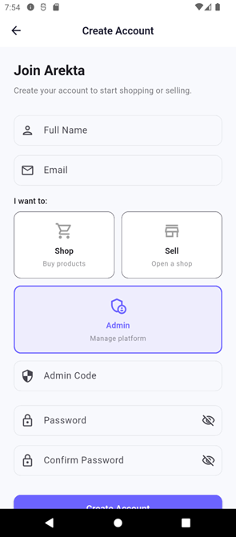 | 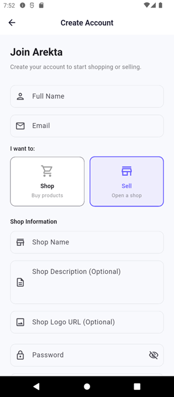 | 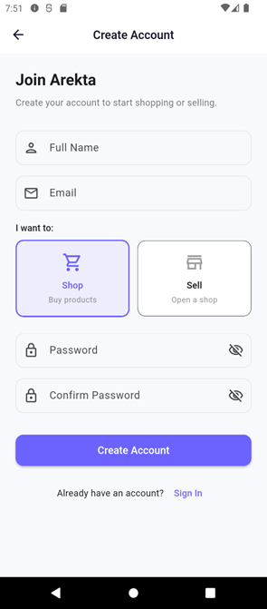 |

### Client Screens

| Home | Products | Product Detail | Cart |
|:---:|:---:|:---:|:---:|
| 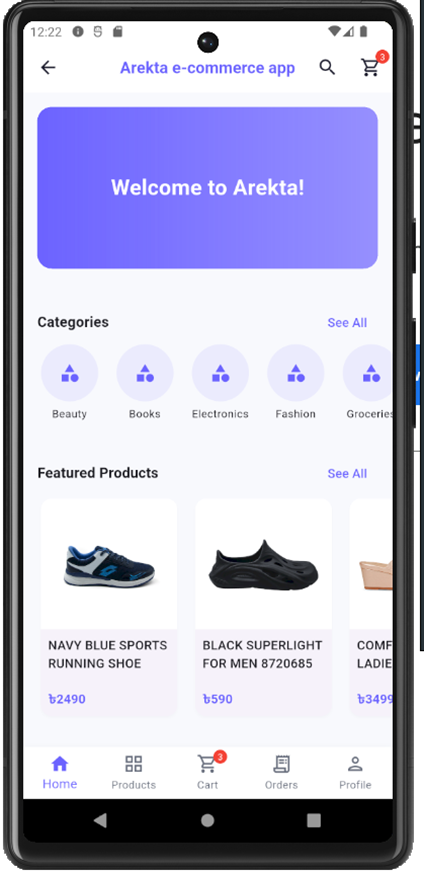 | 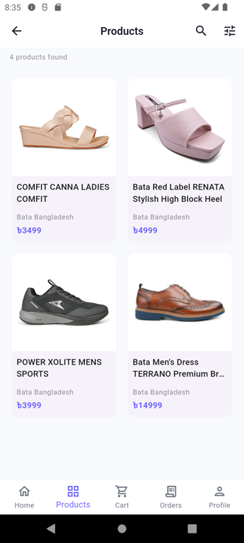 | 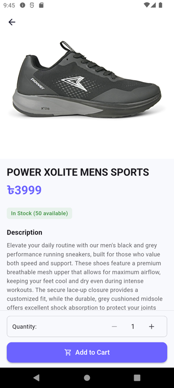 | 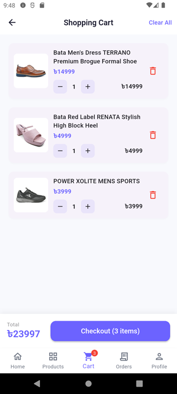 |

### Admin Screens

| Dashboard | Product Approvals | Vendor Approvals |
|:---:|:---:|:---:|
| 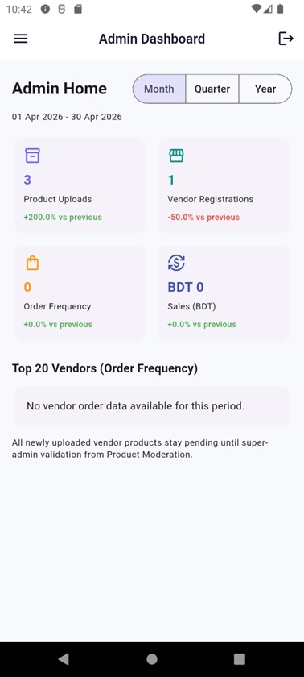 | 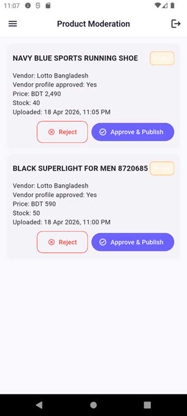 | 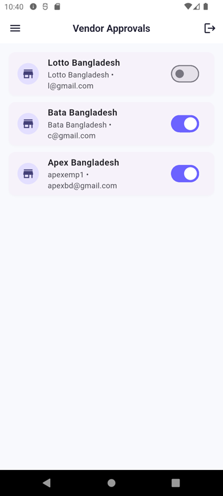 |

### Vendor Screens

| Dashboard | Product Upload |
|:---:|:---:|
| 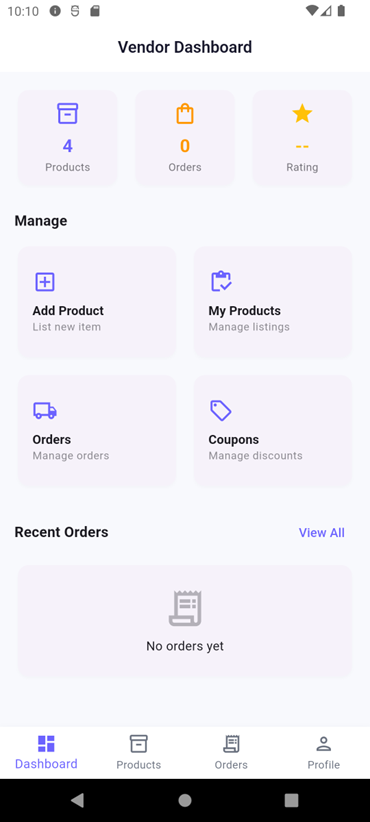 | 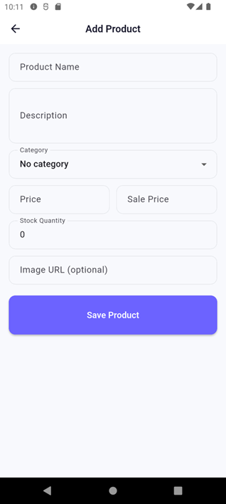 |

---

## Features

### Client
- Browse products with search, category filter, and price range
- Product detail with images, ratings, and reviews
- Shopping cart with quantity management
- Checkout with coupon validation and address selection
- Order history and tracking
- Profile management (name, phone, avatar, addresses)

### Vendor
- Dashboard with sales metrics and inventory alerts
- Product management (add, edit, deactivate)
- Order management (view, update fulfillment status)
- Registration flow with admin approval

### Admin
- Platform dashboard (users, vendors, orders, revenue KPIs)
- Vendor approval management
- Product moderation (approve/reject with notes)
- Carousel, category, and coupon CRUD
- Customer and sales reports

---

## License

This project is licensed under the MIT License.
