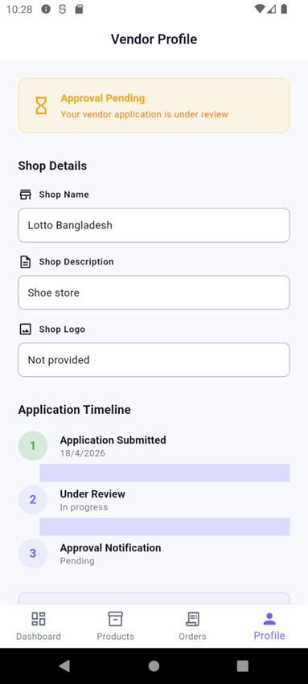

# Arekta E-Commerce Mobile App

A Flutter-based multi-vendor e-commerce mobile application with role-based authentication for admins, vendors, and clients.

## App Screenshots

### Authentication

**Admin Signup** — Register as an administrator to manage the platform  


**Vendor Signup** — Register as a vendor to sell products  


**Client Signup** — Register as a customer to browse and purchase  


**Vendor Signup Flow** — Post-registration confirmation for vendors  


### Client Screens

**Home Screen** — Main landing page with featured products and categories  


**Products Listing** — Browse all available products  


**Product Details** — View product information, images, and pricing  


**Shopping Cart** — Review selected items before checkout  


### Admin Screens

**Admin Dashboard** — Overview of platform stats and management options  


**Product Approvals** — Review and approve vendor product submissions  


**Vendor Approvals** — Review and approve vendor registration requests  


### Vendor Screens

**Vendor Dashboard** — View sales, orders, and platform overview  


**Product Upload** — Add new products with details and images  


---

## Features

- Multi-Role Authentication (Admin, Vendor, Client)
- Admin Dashboard with approval management
- Vendor Dashboard with product uploads
- Client: Browse, cart, and purchase products
- Product upload and approval workflow

## Getting Started

```bash
flutter pub get
flutter run
```

## Tech Stack

| Layer | Technology |
|-------|------------|
| Framework | Flutter (Android + iOS + Web) |
| Language | Dart ^3.10.7 |
| State Management | Provider ^6.1.5 |
| Backend / Auth | Supabase + GraphQL (supabase_flutter + graphql_flutter) |
| UI | Material + custom widgets (Carousel, ratings, badges, cached images) |